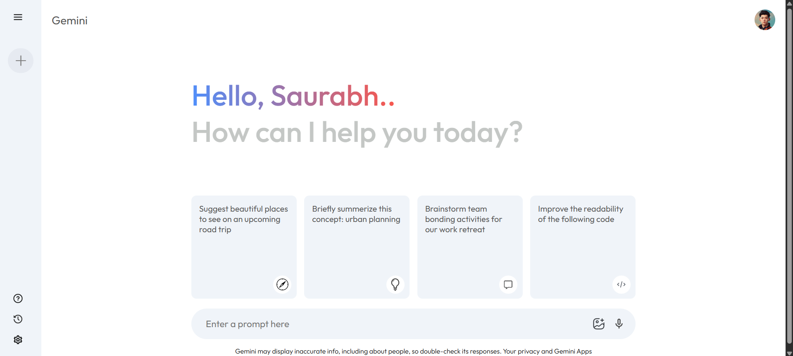

# Gemini
This is a fully responsive Google Gemini-themed web application built using modern web technologies. It replicates the clean layout and intuitive design of the official Google Gemini interface, featuring a sleek UI optimized for both desktop and mobile. While it’s a clone for visual and design purposes, it closely mirrors the look and feel of the original Gemini platform.

---

## Demo
🚀 You can view the live demo of the project here: [Click me](https://gemini-s32a.onrender.com/)

---

## Features
- Clean and modern UI inspired by the official Google Gemini interface.
- Fully responsive design that adapts seamlessly to any screen size.
- Interactive chat interface with a Gemini-like conversation flow.
- Chat history sidebar to easily revisit and continue previous conversations.
- Organized layout with separate sections for messages, input, and navigation.
- Minimal yet functional design optimized for readability and focus.
- Custom styling for buttons, inputs, and conversation bubbles to match Gemini’s look.

---

## Screenshots

  

---

## Technologies Used
- React.js – Handles the structure, layout, and dynamic rendering of the app.
- CSS3 – Provides styling, layout, animations, and responsive design.
- JavaScript (ES6+) – Powers interactive features and chat functionality.
- React Router – Manages navigation between different pages and chat views.
- Google Gemini API (via Hugging Face) – Processes user queries and generates AI-powered responses.

---

## License
This project is licensed under the MIT License - see the LICENSE file for details.

